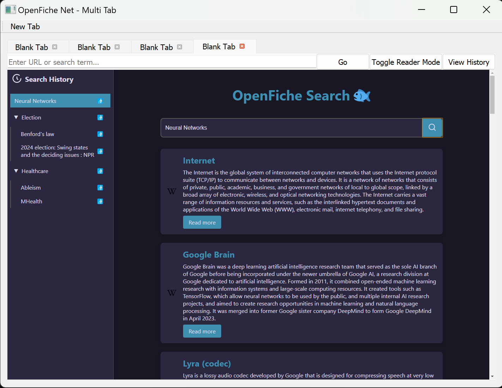
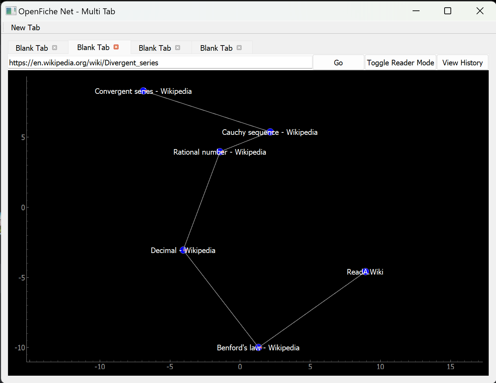
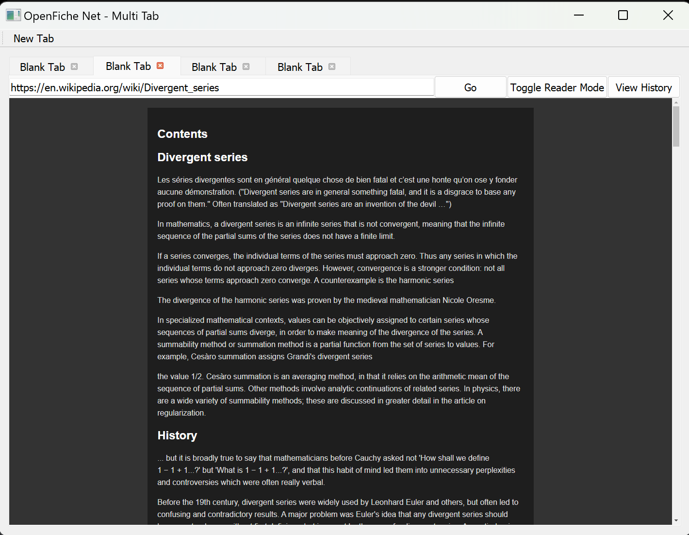

# OpenFiche

OpenFiche is a **post-AI search engine** designed to preserve **high-quality, human-generated content** - like a digital [microfiche](https://en.wikipedia.org/wiki/Microform) for the web. The goal is to filter out AI slop, sponsored results, and paywalled clickbait in favor of trusted sources and distraction-free reading for academic research that requires verifiably accurate information.

> [!NOTE]
> Checkout out the live demo at [reada.wiki](https://www.reada.wiki)

---

## Demo

### Search Results

### Graph View

### Reader Mode

---

## Inspiration

Modern search engines often produce frustrating experiences:

* Search results crowded with low-quality, AI-generated content and sponsored ads
* Articles locked behind paywalls or filled with intrusive advertisements
* Declining quality compared to the PageRank-driven era

OpenFiche aims to restore **clarity and trust in search**, especially for academic contexts, by surfacing **verified, human-written sources** and presenting them in a **streamlined reader interface**.

---

## What It Does

* **Search engine**

  * Indexes a curated catalog of **NPR, CNN, and Wikipedia**
  * Uses ranking algorithms to filter noise and present relevant results

* **Research-focused browser**

  * Graph style search history manager
  * Advanced reader mode to block distractions

---

## Roadmap

* Expand indexed sources beyond NPR, CNN, and Wikipedia
* Improve the browser interface and reader mode
* Optimize performance and scalability of the crawler and indexer

---

## License

MIT License © 2025
